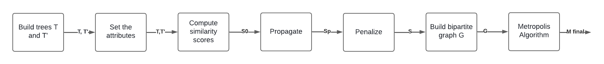

## Dubuisson Samuel

# Research project : Android App Similarity Study

## Supervised by Rouvoy Romain

## Research subject

The subject is [available here](http://projets-info.univ-lille.fr/master/etu/projects/31e02aad-7795-4194-98b4-f61ff4744123) (written in french).

## Why? 

The goal of the project is to provide a tool that is able to compare two android apps (using their apk). 
The implemented program must provide similarity/distance scores between a group of apps. 
Then, it would be possible to cluster the apps in different groups. But how this project would
be useful ?  
- First, by computing similarity scores between the apps, it would be possible to define what apps in our
phone devices would be similar, in terms of frameworks or languages used for example. That may lead to some
deduplication algorithm to gain memory in a given device: if two apps share the same library version, why would we stock it twice in two different places in the device?
- Then, by creating some clusters, some groups of apps using the same technologies will be identified. That may lead to many improves on AI trainings: it would be possible
to retrieve all apps using a given framework, to train a generative model on that dataset, and to get some "specialized copilots". That brings concrete and important improvements:
the generative models will be better (because they are specialized), and more frugal (because the training dataset will be reduced).

## How?

The algorithm used to perform such a thing is greatly inspired from a work performed some years earlier in the same research team by Sacha Brisset. Here is
a link to the [concerned paper](https://hal.science/hal-03774245). The authors created an algorithm to compare two web pages, using tree comparisons. They named their algorithm
Similarity-Based Flexible Tree Matching. I tried to adapt their algorithm to compare android apps instead of web pages. This is meaningful because the android apps are easily represented as trees (using the file structure of the apk).

## Implementation

The algorithm is implemented in Java, with the project management tool Maven.
The program scans a folder that contains apks, can compute the distances between them.

### The program outputs

All the distances computed between apks are between 0 and 1 (0 represents two identical apps, and 1 totally different ones).

All the generated files can be found on the `results` folder. Here are all the files that may be generated:
- `algorithmResults.ser` that stores the class that represents the computed distances. That may allow to rerun the program, without computing the 
same distances a new time. See the run section for more info.
- `distanceMatrix.csv` that offers a csv file representing the distance matrix. 
- `neo4j.txt` that offers a file that represents a [Neo4J](https://neo4j.com/) query file. Copy and paste the results in a query input to create the graph representing all the computed distances
- `cluster.txt` that represents all the computed clusters, according to the given threshold.

### Requirements 

The project uses Java version 17.

### How to?

#### Compilation

To compile the project, run: `mvn package`

#### Run

To run the project, run: `java -jar target/PJI-1.jar` with some available options:
- `-neo4j` that generates the neo4j file.
- `-cluster $threshold$` that generates the cluster file. The given threshold value is used to create the cluster. Hence, the value must be between 0 and 1. All
apks in the same cluster cannot have distance superior to this cluster.
- `-already` that skips the distance computation part. It deserializes the `algorithmResults` class that stores the distance.

By default, the program uses the apks in the `/all_apks` folder. There are ten of them. You can easily add or remove some. The program takes between 5 and 10 minutes to compute distances between all the apks and cluster them.  
However, you can precise another apk folder in the command line by doing so:  
`java -jar target/PJI-1.jar $apk_name$ $options$`  
For example, a folder named `/apks` is also available at the root of the project, and it contains only 3 apks. Hence, it would produce faster results.

## Details 

Here is a scheme representing the general process of the algorithm that computes the matching:

### Differences with the classical SFTM algorithm.

### Tokens and attributes

The tokens do no longer exist in this version. They are replaced by attributes. The idea is quite similar: the attributes of each node are compared with the attributes of other ones.
However, here each node has the same number of attributes, and the attributes are defined. Moreover, contrary to the token approach the logical operations are not necessarily binary: one attribute is not simply equal or not equal. We want to define distance functions between attributes

Four attributes are set for each file:
- The name without the extension and the parent folders.
- The extension
- The hash: calculated using a [simhash](https://en.wikipedia.org/wiki/SimHash) approach. However in an apk, the files are not classical text files. Hence, we simulate words by reading byte chunks (one byte chunk is considered as a word).
- The file size

The first three are used to compute the similarities, and the last one is used later on (we may also want to implement it for distance computation in later work).

### Distance functions

As said, for two different values of the same attributes, it should be possible to compute the distance between them. First of all, all distance functions give values included between 0 and 1. Several distance functions are imaginable, but here are the one chosen:
- The name distance are computed using Levenstein distance
- The extension distance is a binary distance: 0 for the same extension, and 1 otherwise (define fuzzy distance is not pertinent for extensions)
- The hash distance are computed using Hamming distance. 

Then, the different distance functions are passed to a global distance calculator, that multiply each of them by a given weight.

### Matching cost 

The web pages compared in the original SFTM work are composed of tags that have no concrete size. Here the things are different, because the apks are composed of files that are defined by a size.
Hence, when the cost of a matching is computed, the files that have bigger size have a bigger impact on the global cost. If they are not linked, the cost rises faster. This calculation is made thanks to the size attribute. 

